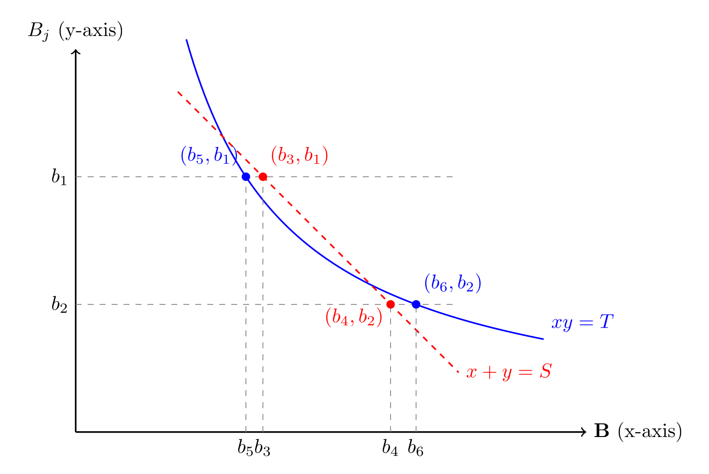

+++
title = "WOMBL 18 - day 01"
date = "2026-06-26T23:30:00+01:00"
darft = false

#
# personal blogpost about the wombl residential 2026
#
# description = "personal blogpost about the wombl residential 2026"

tags = ['WOMBL18']
+++

This year's [WOMBL](https://www.juliawolf.org/seminars/wombl18.shtml) is in Ambleside. We got underway today with some introductory activities.

As we naturally didn't have any proper talks on the first evening so I'll take the opportunity to expound a little on the mathematical side of the 5 minute speed talk I gave.

## Erdős Szemerédi (1983)

[_the following section will only be of any interest to those how have already read the paper in question and even then only of very mild interest at best_]

The paper is best known for the result on the lower bound for  pair-wise sum/products of integers. The result is achieved with some rather involved combinatorial reasoning, which is horrible to read but fun to explain. 

For example, in proving lemma 2.3. they ask us to take six integers $b_1, b_2, b_3, b_4, b_5, b_6$ for the subdivision $B$ (see the original paper for details) such that:

$$b_1+b_3 = b_2+b_4 \quad \text{and} \quad b_1b_5 = b_2b_6.$$

They then make the utterly opaque claim that by picking our integers from specific subdivisions of subdivisions (again, sorry) there can be at most one solution $b_1, b_2$ for each fixed $b_3, b_4, b_5, b_6$. I hope this can be made more clear with the following diagram:

Here $\textbf{B}$ and $B_j$ are disjoint subdivisions of $B$ and so strictly this diagram would be impossible if the x and y axes were rendered at the same scale. The dotted line is supposed to be fixed only in its gradient, so one should imagine it being moved about when trying to explore our degrees of freedom. Naturally also, while the points on the x-axis are fixed, we can swap their labels with each other.

In general it was attempts at clarification of this type that made up the content of my undergraduate project (A cleaned-up version of which I will publish on this website in the near future.)

Actual content to come tomorrow with talks by Akshat Mudgal, Davi Castro Silva and Thomas Bloom (and hopefully a proper internet connection for me.)