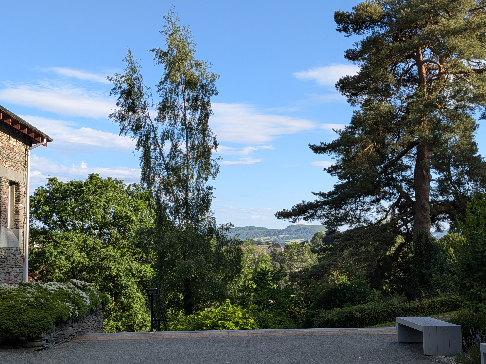

+++
title = "WOMBL 18 - day 1"
date = "2026-06-27T23:55:44+01:00"
darft = false

#
# personal blogpost about the wombl residential 2026
#
# description = "personal blogpost about the wombl residential 2026"

tags = ["wombl18"]
+++

This is our only full day so there is quite a lot to get though. We had three talks before lunch: the first by Akshat Mudgal precenting [A structure theorem for sets with doubling $4 + \delta$](https://arxiv.org/abs/2604.25893), immediately followed by Davi Castro Silva with [An algorithmic Polynomial Freiman-Ruzsa theorem](https://arxiv.org/abs/2604.04547), then the extremely exciting [The sum-product conjecture is false for real numbers](https://arxiv.org/abs/2605.28781) given by Thomas Bloom.

The talk that was the farthest outside my ken was the second one on PFR- but at least it prompted me into do some reading up on the proofs of the Freiman-Ruzsa theorem, which also plays an important role in Mudgal's paper.

The other two contained enough that was familiar to me that I can hopeful write up something more substantial about them when I have more time (believe me I really did try and get something written today). In particular I have already read the fantastic blog post by Tom [here](https://www.erdosproblems.com/forum/thread/blog:6).

*^the verdant UoC Ambleside campus*

After lunch, and after a hike for most and a couple hours distressed note-taking for me, there was a panel discussion on AI.

Perhaps not surprisingly almost every comment made in the course of the discussion was negative. I think if I was instead at a conference on oncology, fears of the possible future destruction of the field would be tempered by talk of potential positives brought about by getting to some solutions quicker. 

Two members of the panel (Ben Green and Tom Bloom) maintain public lists of open problems ([1](https://people.maths.ox.ac.uk/greenbj/papers/open-problems.pdf),[2](https://www.erdosproblems.com/)) making them in my opinion the real victoms of the AI craze, as they have (much like OSS maintainers before them) been inundated with low quality AI submissions.

This points a bit a my main fear with AI which is that to protect the mathematical community against distributed denial of attention attacks by teenagers with ChatGPT-Pro subscriptions we are force to accept more formal gate-keeping and less openness in academia.

The last thing I will say on AI is that every person who I asked at the conference had a paid ChatGPT account, which I very much did not expect. 
